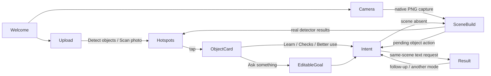

# Figma interaction map — Milestone 3.2

Reference: exported `C:/xampp/htdocs/thing-a-ling-figma/src/App.tsx` and `src/index.css`, plus browser exploration of the unchanged source at http://127.0.0.1:5174. `scripts/serve-figma-reference.mjs` copies only the UI/HTML to an isolated test-results folder and uses existing Vite/React/Tailwind dependencies. Neither the export nor the app server config is modified. The export's Figma hosting plugins are unnecessary for interaction discovery.

The published https://morph-byte-72870981.figma.site was reached with Chrome after the sandboxed request failed. Its splash/branding matched the export. The systematic interaction walkthrough used the local source; 18 screenshots and a state transcript are saved in `test-results/figma-discovery/` (including the published splash). The original mobile object-card close button was overlapped by the object header; navigation was used to leave that state. The integrated close button is above its content and supports Escape with focus restoration.

## Original state machine

`splash` (click or 3.2s) → `camera` (demo room, optional real preview) → `scanning` (fixed 2.2s timer) → `analyzed`, `find`, `fix`, or `improve` according to mode. From analyzed, hotspots open `object`; object actions toggle inline content, Ask opens `ask`, and the suggested location returns to analyzed with a drawn guide. Find submits to `found`; Ask submits to `response`. Mode switches reset query/saved state. Closing an object returns to analyzed, while closing Ask/Find returns to camera. Camera failure enters `error`; Retry invokes getUserMedia. Help is independent overlay state. Upload restarts simulated scanning regardless of actual image contents.

The fixed room, three objects, three issues, keyword Find answers, descriptions, care instructions, recommendation arrows and response are all illustrative. Capture changes state but does not freeze native video pixels. Source CSS includes hardcoded mobile hotspot overrides; these must not be reused for detections.

## Integration map

| Component | Trigger | Expected visual response / original behavior | Real integration / status |
| --- | --- | --- | --- |
| Splash / onboarding | Load, tap, home | Animated brand; fades into demo after 3.2s | Reuse splash, dismissible with keyboard; transition to honest upload/camera welcome, no demo room |
| Camera | Camera toolbar | Real preview, generic error on denial | M3.1 real video, device selection, throttle, cleanup retained |
| Capture | Shutter | Fixed scan timer; original does not freeze video | M3.1 native PNG → actual detection/OCR/Gemma; no continuous Gemma |
| Scan | Upload / explore | Animated sweep, scripted progress, three objects | Retain animation with actual async status; Scan photo runs detector; scene builds explicitly or from object action/capture |
| Hotspot | Detection available | Lime pulsing dot plus name at fixed position | Actual MediaPipe box-relative anchor (horizontal center, quarter height); label/confidence; no mobile coordinate overrides. Quarter height separates nested portrait/person/tie anchors without changing their real boxes. |
| Object card | Tap hotspot | Slide-up sheet, icon/name/status, actions, suggestion | Adapt original object-head/action-grid styles; detector label/confidence/coordinates and source-linked scene evidence; no guessed condition |
| Context actions | Learn, checks, better use | Inline scripted answer | Shared-scene goal request; build once if absent, then text-only response; cancellation/retry retained |
| Ask object | Card Ask | Prefilled input in Ask sheet | Prefill actual object ID/evidence; user edits/submits; same scene retained |
| Explore | Mode tab | Three example hotspots | Real detections and model overview; honest zero-detection status |
| Find | Goal and submit | Keyword match to lamp/TV/sofa with fabricated ports | Existing grounded intent engine, evidence and empty-capability gate; no fake location rings |
| Fix | Mode tab / issue | Fixed red hotspots/severity and “mark fixed” | Evidence-supported issues/checks in results; no inferred issue coordinates or safety certification |
| Improve | Mode / suggestion | Three scripted opportunities and guide | Actual intent response; no precise placement arrow without measured evidence |
| Ask This Space | Ask This Space | Sheet → fixed response | Existing editable goal/follow-up workflow; conversation and scene survive sheet close |
| Voice | Mic / language | Browser SpeechRecognition, potentially remote transcription | Intentionally not activated; typed input and local-privacy explanation retained |
| OCR / labels / study | Read text, goal chips | Not actually analyzed by prototype | Existing local OCR and evidence-grounded label/study goals remain accessible |
| Retry / errors | Denial / model failure | Generic camera error, demo fallback | Real camera-specific errors plus inference timeout/cancel/retry; upload fallback |
| Save / fixed / placement guide | Prototype buttons | In-memory tick / hardcoded coordinates | Intentionally omitted: no persistence, no verified repair, no supported placement coordinates |
| Help / fullscreen | Toolbar | Modal / fullscreen | Existing accessible dialog and fullscreen retained |
| Mobile | Narrow viewport | Bottom sheet/nav; fixed hotspot repositioning | Reuse responsive sheets and nav; geometric hotspots remain image-relative |

## Implemented state flow

The existing ReasoningPanel stays mounted when a sheet closes or an object opens. App holds a read-only scene snapshot for cards; the panel retains authoritative scene/history, cancellation and request generation guards. New uploads clear cards/snapshots and remount the panel. Actions request the existing engine rather than duplicating it. Building and failed/cancelled requests remain explicit UI states; no timer claims completion.

Implemented files: `src/components/ObjectCard.tsx`, `ImagePreview.tsx`, `ReasoningPanel.tsx`, `src/services/objectSelection.ts`, `src/App.tsx`, `src/App.css`. The existing detector, OCR, scene assembly, evidence validation, intent engine and Ollama bridge are unchanged in this milestone. Source object-card classes and animations are reused from the already imported Figma stylesheet. No dependencies were added.

## Actual validation — 2026-10-09

- Production build passed, including all 17 local asset hashes. Lint passed. All **23 unit tests** passed, including same-name object association/provenance (a Gemma name cannot acquire a detector box).
- New browser interaction suite passed on the production build: four actual animal detections; one **person at 94.9%** plus a **tie at 69.0%** in the portrait (both preserved); blank image yielded zero detections/hotspots and an honest empty state. Desktop 1280px and mobile 390px/320px verified box-relative hotspot alignment, card fit, normal pointer interaction, Escape dismissal and focus restoration. Zero external requests and zero page errors.
- The real object-action workflow completed using installed `gemma3:4b`: **63.45s scene wall time** (63.16s model duration), then **51.2s** for the text-only object response, **115.81s** from the first card action to displayed result. Network trace: **one image request, one text-only request**. Opening a different object's Ask card kept the same scene ID, correctly prefilled `mp-1`, and made no additional request. This is a functional measurement, not a controlled speed benchmark; other browser tests were running.
- The live-run report retains a later **test assertion failure** comparing visually capitalized `Person` with source text `person`. The inference and reuse checks had already passed. That assertion was corrected to check DOM text content; the full production interaction suite subsequently passed. The costly Gemma pair was not repeated solely for this assertion or CSS changes. See `test-results/interactions-live.json` and `interactions-browser.json`.
- Real Gemma output still miscounted animals and described closed eyes incorrectly. Its answer also discussed the wider scene, so precise object disambiguation remains limited. These outputs are shown unchanged with provenance/uncertainty; JSON validity is not factual verification.
- Existing M1 browser regression passed (real detection/OCR, local assets, cold external-network block, warm full-browser-offline inference, geometry, disposal and error recovery). Existing M3 regression passed (recorded M2 responses for UI-only mode/history/cancellation/retry checks, real detection/OCR). Existing model failure/timeout suite passed. Its unavailable/malformed outputs are deliberate error injection, not application answers.
- Camera regression passed in Chrome **153.0.8010.55** and Edge **154.0.4258.62**, using file-backed video and real MediaPipe. Capture sent actual pixels to the shared-scene boundary; that suite deliberately injects HTTP 503 to check Retry. No continuous Gemma, external requests or uncaught errors; source switches/Stop/pagehide released tracks. This does not claim new physical-camera verification; M3.1's permission-denial limitation remains.

Discovery screenshots/transcript: `test-results/figma-discovery/`. Integrated screenshots: `interactions-card-1280.png`, `interactions-card-390.png`, `interactions-card-320.png`, `interactions-person.png`, `interactions-empty.png` under `test-results/`.

## Test / demo

1. Start local Ollama with `gemma3:4b` and the application on http://localhost:5173. The reference source can separately run with `node scripts/serve-figma-reference.mjs` on loopback port 5174.
2. Upload an image. Close the scene panel and select **Scan photo**, or use **Detect objects** below the viewfinder. Tap a lime dot or its label. Select **Learn about it**, **What should I check?**, or **Make better use** to build/reuse the scene and obtain a real response. **Ask something** opens an editable goal.
3. Close/reopen cards, change mode or ask a follow-up. The existing scene persists. Use Read text and the label/study goal chips for OCR-grounded questions.
4. With physical camera permission, Capture & explore builds the same scene from a frozen native frame. If permission is denied, use upload. No model runs continuously on live video.

Reproduce with `npm run build`, `npm run lint`, `npm run test`; `node scripts/run-browser-check.mjs <suite> <path-to-playwright/index.mjs>` for `validate-milestone1`, `validate-milestone3`, `validate-reasoning-failures`; `node scripts/validate-interactions.mjs <path-to-playwright/index.mjs>`; `node scripts/validate-camera.mjs <path-to-playwright/index.mjs>`. Only add `--live-gemma` to the interaction suite when another actual inference pair is warranted.

## Intentional limits

No remote-capable voice transcription, fake saved-idea persistence, “all fixed” certification, guessed issue coordinates, placement arrows or example room results were copied into real workflows. Camera selection/permission depends on hardware/browser support. Dense detections can still have overlapping labels; circles stay above labels, and the evidence list remains available. The original image and measured boxes are preserved.

Reasoning remains laptop-local Ollama through a development-only loopback proxy. A public production deployment has browser detection/OCR but **no developer-local Gemma access**. There is no cloud fallback, no remote image upload, no new telemetry, and no new claim of offline page reload support. Voice and these deployment limits must be stated honestly in the submission/demo.

## Object discovery presentation refinement

The subsequent refinement replaces the tall, mostly empty discovery stage with an image-sized composition and a compact side card. On phones, the full-aspect image sits above a bottom-sheet-style card in normal page flow; expanding evidence does not introduce an inner scrollbar. The original detector boxes and hotspot anchors still use native image coordinates. Live camera controls and the rest of the site retain their existing layout.

The card leads with the actual detector label and a short detection-derived statement, then category-specific actions. It does not guess condition, purpose or identity to fill an empty description. Confidence, coordinates, source evidence and uncertainty are collapsed under **AI details, evidence & uncertainty**. Completed object-action answers can be revisited with **View [object] discovery** or by reopening that hotspot. The card shows an unchanged answer excerpt and offers the full answer; it never substitutes a canned explanation. Answers are associated with the originating label/box and scene ID, not merely a matching name, and clear on image replacement. A new or edited general question remains in the shared-scene conversation rather than being arbitrarily attributed to an object.

Contextual labels are deterministic UI choices, not model conclusions:

| Detection category | Actions |
| --- | --- |
| People | Learn about the scene; Ask about the photo; Explore surroundings |
| Furniture | Uses; Organize; Improve placement; Ask |
| Plants | Learn; Care guidance; Check visible concerns; Ask |
| Documents / books | Read text; Explain; Summarize; Study |
| Other objects | Learn; Use; Check; Ask |

People prompts explicitly prohibit identification and personal-trait inference. Plant guidance is conditional on confirming species/conditions, and placement actions prohibit invented measurements. Read text invokes the existing OCR service on the **whole photo**, clearly labeled; it does not pretend to crop/localize text to a document box. The detector's label vocabulary is limited, so standalone labels/documents may have no detection hotspot; the existing independent Read text workflow remains available. All generated descriptions, answers and text still come from the existing inference services.

Changed presentation files: `ObjectCard.tsx`, `objectDiscovery.ts`, `ImagePreview.tsx`, `App.tsx`, `App.css`; `ReasoningPanel.tsx` adds a completed-turn notification for displaying saved answers and uses the same category action labels. No inference service, schema, model, OCR worker, proxy, dependency or privacy policy was changed.

Validation: build and 17 asset hashes passed; lint passed; **26 unit tests** passed. Real browser detection on the four-animal, portrait (person plus tie) and blank fixtures passed at 1280/390/320px, including full aspect ratio, accurate hotspot mapping, collapsed evidence, keyboard dismissal and focus restoration. The existing M1 offline/detection/OCR regression, M3 mode/history/cancellation/retry regression and model-failure/timeout suite passed.

New `validate-discovery-reuse` browser checks passed: one scene request and one text-only action, saved response on the originating box only, separation of two same-named dogs, no requests on reopening/changing cards, new-image reset, and no mobile inner scrollbar even with evidence expanded. This uses a projection of the actual recorded M3.1 animal scene and its recorded Find response at the HTTP boundary, solely to test UI state/display; it is **not fresh inference or a test of answer relevance**. The fixture is never imported by application code. No new long-running Gemma inference was needed for these presentation changes. Network traces contained no external requests; browser checks reported no uncaught page errors.

Latest screenshots: `test-results/interactions-card-1280.png`, `interactions-card-390.png`, `interactions-card-320.png`, and `discovery-saved-answer-desktop.png` / `discovery-saved-answer-390.png`. Run `node scripts/run-browser-check.mjs validate-discovery-reuse <path-to-playwright/index.mjs>` to repeat the new recorded-response UI check.
